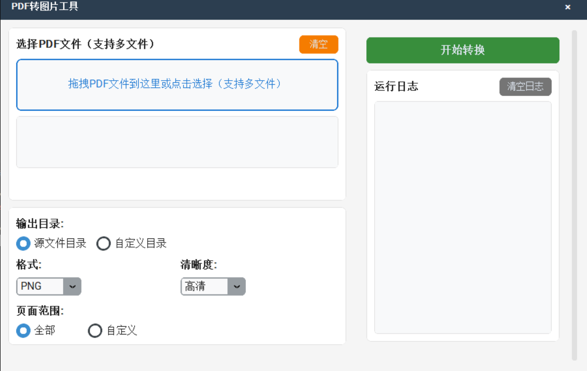

# PDF转图片工具

一个现代化的PDF转图片工具，采用精简设计和卡片式布局。支持GUI界面和命令行两种使用方式，基于PyMuPDF构建，无需外部依赖。支持多文件批量转换和智能清晰度挡位选择，默认高清质量。



## 🔧 功能特性
- 📋 **多文件批量处理** - GUI和CLI都支持同时处理多个PDF文件
- 🎨 **多种输出格式** - 支持PNG、JPEG、TIFF格式
- 🔧 **清晰度挡位** - 一般(150)/清晰(200)/高清(300)/打印(600)DPI，默认高清
- 📁 **独立文件夹组织** - 多文件转换时为每个PDF创建单独子文件夹
- 🌐 **中文界面** - 完全支持中文显示
- ⚡ **高性能** - 基于PyMuPDF库，转换速度快，内存占用低
- 🚀 **零外部依赖** - 无需安装poppler或其他工具

## 🚀 快速开始

### 安装依赖

确保你的系统已安装Python 3.13+和uv包管理器。

```bash
# 进入项目目录
cd pdf_to_image

# uv会自动安装所有依赖
uv sync
```

### GUI模式（推荐）

```bash
# 启动GUI界面
uv run gui.py
```

或者直接双击 `run_gui.bat` 文件。

**GUI使用步骤：**
1. 拖拽PDF文件到虚线框内，或点击拖拽区域选择文件（支持多文件）
2. 设置输出目录（默认为PDF文件同目录）
3. 选择输出格式（PNG/JPEG/TIFF）
4. 选择清晰度挡位（一般/清晰/高清/打印）
5. **页面范围**：单文件时可选择"全部"或"自定义"，多文件时自动为"全部"
6. 点击右侧的"开始转换"按钮

### 命令行模式

```bash
# 单文件转换 - 基本用法
uv run main.py document.pdf

# 多文件批量转换
uv run main.py file1.pdf file2.pdf file3.pdf -o ./images/

# 指定清晰度挡位
uv run main.py document.pdf -q 高清

# 使用自定义DPI（覆盖清晰度设置）
uv run main.py document.pdf -d 400

# 单文件指定页面范围（多文件不支持）
uv run main.py document.pdf --pages 1-5

# 组合参数
uv run main.py document.pdf -o ./output/ -f PNG -q 打印 --pages 2-10
```

## 📋 命令行参数

| 参数 | 简写 | 说明 | 默认值 |
|------|------|------|--------|
| `pdf_paths` | - | PDF文件路径（支持多个，必需） | - |
| `--output` | `-o` | 输出目录 | 第一个PDF同目录 |
| `--format` | `-f` | 输出格式 (PNG/JPEG/TIFF) | PNG |
| `--quality` | `-q` | 清晰度挡位 (一般/清晰/高清/打印) | 高清 |
| `--dpi` | `-d` | 自定义DPI值（覆盖清晰度设置） | - |
| `--pages` | - | 页面范围（仅单文件支持） | 全部页面 |

### 清晰度挡位说明

- **一般**: 150 DPI - 适合快速预览和网页显示
- **清晰**: 200 DPI - 平衡质量和文件大小
- **高清**: 300 DPI - 默认设置，高质量显示，适合印刷前预览
- **打印**: 600 DPI - 最高质量，适合专业印刷

### 页面范围格式（仅单文件）

- `1-5`: 转换第1页到第5页
- `3`: 只转换第3页
- 留空: 转换所有页面

## 📁 输出文件组织

### 单文件模式
```
输出目录/
├── document_page_001.png
├── document_page_002.png
└── document_page_003.png
```

### 多文件模式
```
输出目录/
├── file1/
│   ├── file1_page_001.png
│   ├── file1_page_002.png
│   └── file1_page_003.png
├── file2/
│   ├── file2_page_001.png
│   └── file2_page_002.png
└── file3/
    ├── file3_page_001.png
    ├── file3_page_002.png
    └── file3_page_003.png
```

## 🛠️ 技术架构

### 核心依赖

- **PyMuPDF**: PDF处理和渲染核心库
- **Pillow**: 图像格式转换
- **tkinterdnd2**: GUI拖拽支持
- **customtkinter**: 现代化GUI组件库

### 项目结构

```
pdf_to_image/
├── main.py          # 命令行主程序（支持多文件转换）
├── gui.py           # GUI界面程序（多文件选择，清晰度挡位）
├── run_gui.bat      # Windows启动脚本
├── pyproject.toml   # 项目配置
├── uv.lock         # 依赖锁定文件
├── README.md       # 项目文档
└── CLAUDE.md       # 开发记忆文件
```

## 🐛 故障排除

### 常见问题

**Q: 多文件转换时无法选择页面范围**  
A: 这是设计限制，多文件模式只支持全部页面转换以保持一致性

**Q: 转换失败，提示PDF处理错误**  
A: 检查PDF文件是否损坏，或尝试降低清晰度设置

**Q: GUI界面无法启动**  
A: 确保已正确安装依赖：`uv sync`

**Q: 页面范围验证失败**  
A: 检查输入的页面号是否在有效范围内（1到PDF总页数）

**Q: 转换速度慢**  
A: 降低清晰度设置或减少转换页面数量

**Q: 输出图片模糊**  
A: 提高清晰度设置（推荐"高清"或"打印"挡位）